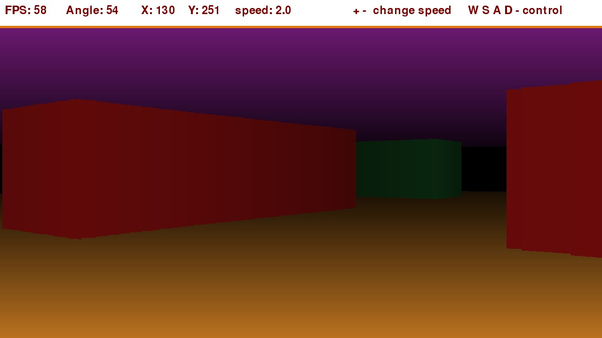
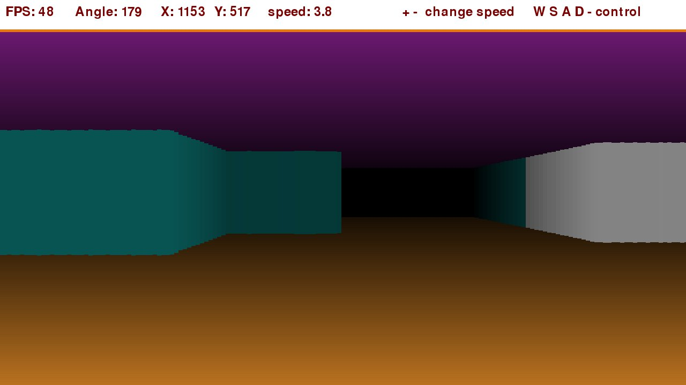
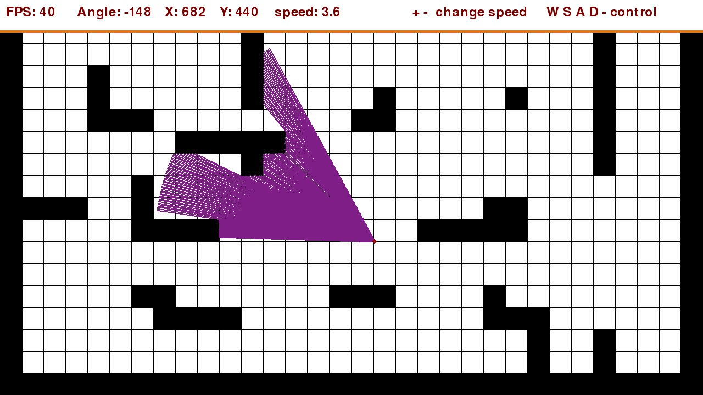

# PyRayCast

### raycasting in python with using pygame

install pygame and run code

-pip3 install pygame

---

---

---

## Control:
    ESC   Exit program
    F1    Take screen shot jpeg
    + -   Change speed
    W S   Walk
    A D   Rotate